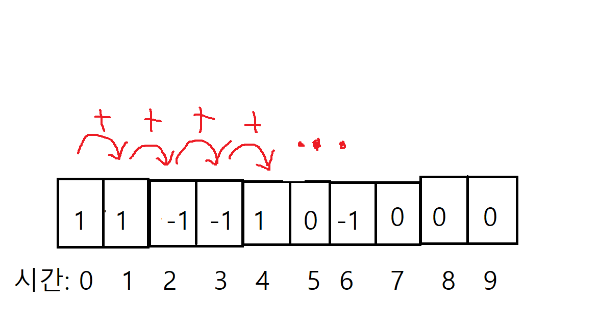

# KaKao_blind_test 2021
카카오 블라인드 테스트 문제 풀이 코드입니다.

## 신규 아이디 추천
적당한 구현 문제, 전형적인 난이도 쉬운 1번 문제이다.

정규표현식을 사용하면 짧은 코드로도 구현이 가능하다.

## 메뉴얼 리뉴얼
주어진 주문으로부터 조합을 추출하고 해당 조합이 각 주문에 들어가는 지 확인한다.

조합을 구할 수 있는지, 그리고 그것을 바탕으로 카운트를 구현할 수 있는 지를 묻는 문제이다.

다음과 같은 함수를 사용하면 쉽게 구현할 수 있다.
```python3
from itertools import combinations

s = ['a','b','c','d','e']
list(combinations(s, 2)) # 조합을 구하는 함수
'''
[('a', 'b'),
 ('a', 'c'),
 ('a', 'd'),
 ('a', 'e'),
 ('b', 'c'),
 ('b', 'd'),
 ('b', 'e'),
 ('c', 'd'),
 ('c', 'e'),
 ('d', 'e')]
'''

from collections import Counter

l = ['a','a','b','c','c','c','c']
counts = Counter(l) # 수를 세 dict 타입으로 반환
# Counter({'a': 2, 'b': 1, 'c': 4})

counts.most_common() # value값이 큰 순서대로 list 형태로 item을 반환, 이 때 매개 변수는 몇 개의 값을 반환할 것인지
# [('c', 4), ('a', 2), ('b', 1)]

st = 'fdczxdasd' 
sorted(st) # 이렇게 하면 문자열을 정렬 및 list로 쪼개준다.
# ['a', 'c', 'd', 'd', 'd', 'f', 's', 'x', 'z']
```
## 순위 검색
효율성을 생각하지 않는다면 리스트로 자료를 저장한 다음 일반적인 선형탐색으로도 답을 찾을 수 있지만

제한 시간 내에 통과하려면 트리 자료구조와 이진탐색을 사용해야 한다.

다음과 같은 패턴으로 트리 구조를 만들 수 있다.
```python3
data_dict = {}

lang_val = ['cpp', 'java', 'python', '-']
job_val = ['backend','frontend', '-']
level_val = ['junior', 'senior', '-']
food_val = ['chicken', 'pizza', '-']

for lang in lang_val:
    data_dict[lang] = {}
    for job in job_val:
        data_dict[lang][job] = {}
        for level in level_val:
            data_dict[lang][job][level] = {}
            for food in food_val:
                data_dict[lang][job][level][food] = []
```
이렇게 해당 값을 참조하게 되는 모든 쿼리문에 대해 트리를 만든다.

이진 탐색은 직접 구현할 필요 없이 다음과 같은 함수를 사용해 쉽게 구현한다.
```python3
from bisect import bisect_left()

bisect_left([1,2,3,4,5], 2.5) # 정렬된 리스트에 대해서 입력값의 적절한 위치를 반환한다.
# 2
```
이 때 `bisect_left`와 `bisect_right`의 가장 큰 차이는

같은 값에 대해서 왼쪽에 위치할 것인지 오른쪽에 위치할 것인지에  차이이다.

`bisect`는 `bisect_right`와 같다.

다만 이와 같은 풀이는 같은 값을 매우 많이 저장하게 되므로 실무에서는 다른 방법을 사용해야 할 것이다.
## 합승 택시 요금
출발지점 s, A의 집 a, B의 집 b 이렇게 세 지점까지의 거리의 합이 가장 작은 노드가 환승지점이 된다.

각 노드 간의 최소 거리는 다익스트라 알고리즘을 통해 구할 수 있다.

다익스트라 알고리즘에 대한 설명은 링크로 대신한다.

[위키 백과](https://ko.wikipedia.org/wiki/%EB%8D%B0%EC%9D%B4%ED%81%AC%EC%8A%A4%ED%8A%B8%EB%9D%BC_%EC%95%8C%EA%B3%A0%EB%A6%AC%EC%A6%98)

처음 문제를 풀었을 때에는 시간초과가 났었는데 그것은 문제에 대한 접근이 잘못되었기 때문이었다.

s, a, b까지의 거리의 합이 최소인 노드를 찾기 위해 전체 노드를 순회하는데

나는 매 노드를 순회할 때마다 거리를 계산하였다.

하지만 그럴 필요 없이 우리의 출발지는 s, a, b 단 세 곳이므로 세 번만 탐색을 하면 된다.

각 출발지로부터 모든 노드의 최소 거리가 있는 테이블을 반환하면 더 이상 탐색을 할 필요가 없다.

주요 구현은 다음과 같다.
```python3
dic_route={} 
# dict 생성
    
for i in range(1, n+1):
    dic_route[i] = [] 
# 모든 dict에 list를 생성

for route in fares:
    for j in range(2):
        dic_route[route[j]].append([route[(j + 1) % 2], route[2]])
# key를 노드의 번호로하고 value는 갈 수 있는 노드와 비용을 저장

for i in range(1, n + 1):
    dic_route[i].sort(key=lambda x: x[1])
# 그리디로 탐색할 수 있도록 비용 순으로 정렬
```
이 때 중요한 것은 쉽게 경로를 참조할수 있도록 출발지로 한 번, 도착지로 한 번, 총 두 번 저장하는 것이다.

```python3
def short_distance(s, dic_route):
    visited = [1000000000000 for _ in range(len(dic_route) + 1)] 
    # 무한대 값을 넣은 노드 길이의 리스트 생성, 
    # 이때 노드의 수보다 1 크게 리스트를 만든것은 
    # 노드의 인덱스가 1부터 시작하기 때문이다.
    visited[s] = 0
    # 출발지 값은 0
    q = [x for x in dic_route[s]]
    # 큐 생성 및 출발지에서의 경로들을 push
    
    while len(q) > 0:
        temp_node = q.pop(0)
        # pop
        
        if temp_node[1] < visited[temp_node[0]]:
            visited[temp_node[0]] = temp_node[1]
        else:
            continue
        # 노드에 도착했을 때, 거리를 비교해 작으면 값을 넣고 크면 큐의 다음 값으로 넘어간다.

        for node in dic_route[temp_node[0]]:
            q.append([node[0], node[1] + temp_node[1]])
        # 최소값이었다면 큐에 갈 수 있는 경로들을 지금까지의 거리 정보와 함께 푸쉬한다.
    
    return visited
```
경로 문제에 대해 거부감이 있어서 다익스트라에 대한 공부를 피해왔었는데

다익스트라 알고리즘에 대해 공부할 수 있는 좋은 기회가 되었다.

그리고 정리하다 보니 의미없는 코드가 상당히 많았다.

좀 더 신중하게 코딩을 할 수 있도록 노력해야겠다.

## 광고 삽입
이 문제는 총 재생 시간 길이 만큼의 배열을 생성해 누적 시청자 수를 기록하는 것이 포인트이다.

처음에는 이 방식으로 접근하였으나, 배열에 시청자 수를 입력하는 방식이 좋지 못해 시간 초과가 났다.

다음과 같은 방법을 사용하면 작은 시간복잡도로 누적 시청자 수를 기록할 수 있다.

1. 총 시간 길이만큼의 배열을 생성해 0으로 초기화한다.
<center></center>

2. 플레이 기록을 하나 하나 참조해 시작 지점에서는 1을 더하고, 종료 지점에서는 1을 빼준다.
<center></center>

3. 2번째 인덱스부터 끝까지 각 값에 바로 전 인덱스의 값을 더해준다.
<center></center>

4. 다음과 같이 각 시간대에 누적 시청자수가 기록된다.
<center></center>

이렇게 누적 시청자 수 배열을 만들면 이동하는 윈도우를 만들어 

총합이 가장 큰 윈도우의 시작 인덱스가 광고를 삽입할 시간이 된다.

마지막으로 출력포맷이 반드시 두자리수여야 하므로 다음과 같은 포맷을 사용하면된다.

```python3
num = 7
s = f'{num:02d}'
# '07'
```

## 카드 짝 맞추기

처음으로 할 일은 조사할 모든 순서를 구하는 것이었다.

카드는 최대 6가지 종류가 존재하므로 카드를 맞추는 순서는 최대 6!개이다.

또한 각 카드는 두 장씩 존재하므로 조사해야 하는 순서는 최대 6! * 2^6개이다.

이를 위해 `board` 위에 같은 값을 가진 카드를 하나는 그대로, 

다른 하나는 음수값으로 치환해 두 카드를 구분할 수 있도록 하였다.

다음 코드로 모든 순서를 구할 수 있었다.
```python3
ones_list = [1 for _ in range(card_n)] + [-1 for _ in range(card_n)]
# n개의 1과 n개의 -1로 이루어진 리스트

permu_list = list(permutations(card_set))
# board 위에 존재하는 카드들의 수열들

temp_list = []
for ones in list(set(permutations(ones_list, r=card_n))):
# 중복 가능한 1과 -1로 이루어진 길이 n의 수열들
    for per in permu_list:
        temp = []
        for j in range(card_n):
            temp.append(ones[j] * per[j])
        # 카드들의 수열과 1과 -1의 수열을 요소곱한다. 
        temp_list.append(temp)
```
예를 들어 `board` 위의 카드가 1, 2 두 가지가 존재한다면 나올 수 있는 순서는

`[[1, 2], [-1, 2], [1, -2], [-1, -2], [2, 1], [-2, 1], [2, -1], [-2, -1]]`가 된다.

다음은 현재 커서에서 목적지까지 이동하는데 걸리는 최소 이동 횟수이다.

이는 bfs로 구현하면 되는데 효율성 통과를 위해서 같은 지점을 방문 시 이를 걸러줘야 한다.

일단 board 크기의 visited 테이블을 생성하고 값을 0으로 초기화해준다.

해당 지점에 도착했을 때 테이블의 해당 지점의 값이 0이라면 테이블에 1을 입력해준다.

반면 테이블의 해당 지점이 1이라면 현재 경로는 파기하고 큐의 다음 경로를 탐색한다.

bfs의 구현은 다음과 같다.
```python3
def count_key(board, r, c, i, j):
    x1,x2,y1,y2 = r,i,c,j
    visited = [[0,0,0,0],[0,0,0,0],[0,0,0,0],[0,0,0,0]]
    # visited table 생성
    
    q = []
    q.append([0, x1, y1])
    
    while q:
        temp = q.pop(0)
        temp_x = temp[1]
        temp_y = temp[2]
        
        if visited[temp_x][temp_y]:
            continue
        # visited값이 있을 경우 현재 경로를 탐색하지 않고 q의 다음 경로 탐색
        
        visited[temp_x][temp_y] = 1
        # visited값이 없다면 1을 입력후 현재 경로 탐색
        
        if temp_x == x2 and temp_y == y2: 
            return temp[0]
        # 해당 지점에 도착하였다면 이동횟수 반환
        
        if temp_x < 3: 
            temp_x += 1
            q.append([temp[0] + 1, temp_x, temp_y])
            # 오른쪽으로 한칸 이동
            while temp_x < 3 and board[temp_x][temp_y] == 0:
                temp_x += 1
            q.append([temp[0] + 1, temp_x, temp_y])
            # 오른쪽으로 컨트롤 이동
            temp_x = temp[1]
            # 이동값 초기화
        if temp_y < 3: 
            temp_y += 1
            q.append([temp[0] + 1, temp_x, temp_y])
            # 아래쪽으로 한칸 이동
            while temp_y < 3 and board[temp_x][temp_y] == 0:
                temp_y += 1
            q.append([temp[0] + 1, temp_x, temp_y])
            # 아래쪽으로 컨트롤 이동
            temp_y = temp[2]
            # 이동값 초기화
        if temp_x > 0: 
            temp_x -= 1
            q.append([temp[0] + 1, temp_x, temp_y])
            # 왼쪽으로 한칸 이동
            while temp_x > 0 and board[temp_x][temp_y] == 0:
                temp_x -= 1
            q.append([temp[0] + 1, temp_x, temp_y])
            # 왼쪽으로 컨트롤 이동
            temp_x = temp[1]
            # 이동값 초기화
        if temp_y > 0: 
            temp_y -= 1
            q.append([temp[0] + 1, temp_x, temp_y])
            # 위쪽으로 이동
            while temp_y > 0 and board[temp_x][temp_y] == 0:
                temp_y -= 1
            q.append([temp[0] + 1, temp_x, temp_y])
            # 위쪽으로 컨트롤 이동
            temp_y = temp[2]
            # 이동값 초기화
```
효율성 검사를 통과하기 위해선 한 가지 방법을 더 사용해야 한다.

그것은 바로 각 순서를 검사하는 중에 카드 하나를 제거할 때마다 

현재 이동 횟수를 현재까지의 최소 이동 횟수와 비교해서 값이 커질 경우

해당 순서를 파기하고 바로 다음 순서를 탐색하는 것이다.

이렇게 최소 이동 거리를 탐색할 때 한번, 순서를 탐색할 때 한번

총 두번의 백트래킹을 해줘야 효율성 검사를 통과할 수 있다.
